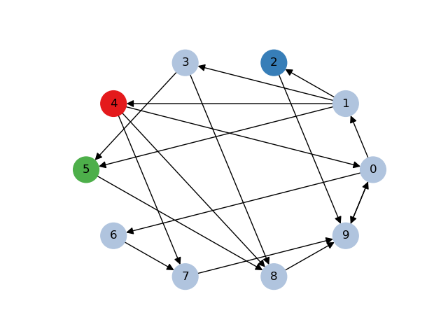
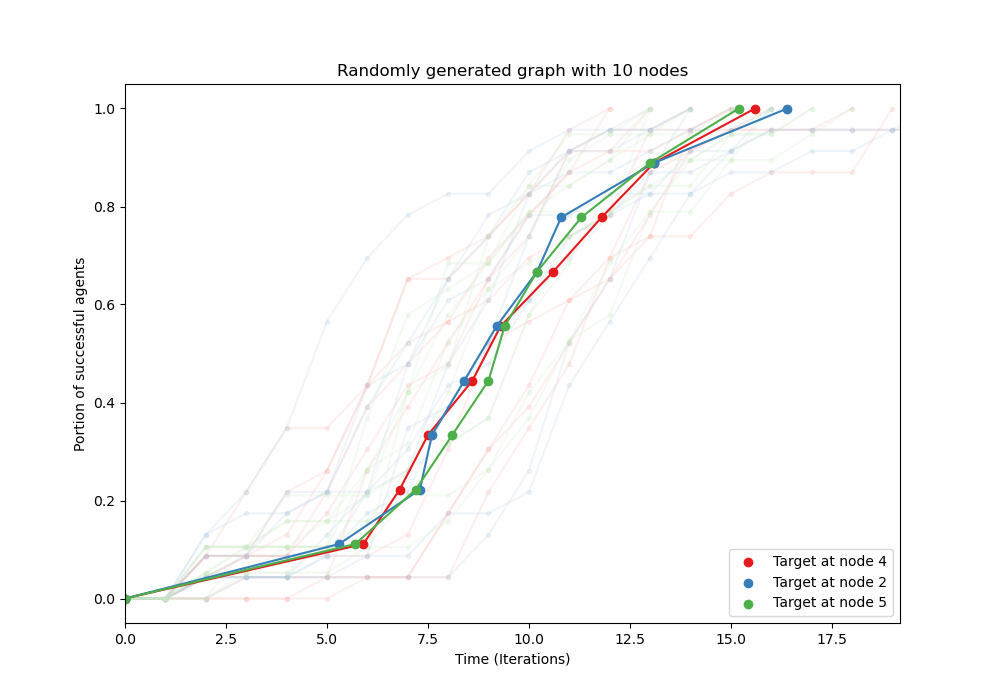

# Bayesian Particles

<p align="center">
  
  </p>

<p align="center">
  
&nbsp; &nbsp; &nbsp; &nbsp;
  
</p>

### Installing and Running
To randomly generate a circulative network and simulate Bayesian particles searching for a target: clone the repository, move into the new directory, and run a simulation.
```
gh repo clone anapervan/temp-bayesian-particles
cd temp-bayesian-particles
python3 main.py
```

### Arguments
Optional arguments to enter on the command line are:
- `num_nodes` = The number of nodes in the randomly generated graph (default=10).
- `num_targets` = The number of targets for the agents to search for. This must be less than the total number of nodes (default=1).
- `num_trials` = The number of simulations to run for each target location (default=10)
- `no_output_plot` = A boolean flag for whether or not to plot output data. To SKIP the plot, add this flag.

### Examples
To simulate a randomly generated graph with **10** nodes, with the target at **5** different locations and **20** simulations for each target location (a total of 100 simulations). The command is:
```
python3 main.py --num_nodes=10 --num_targets=5 --num_trials=20
```
To run this simulation without plotting the resulting graph or plots of the agents' performance, add `--no_output_plot` to the end.


Sample data is saved in the `output_example` folder. To simply plot the saved data without running new simulations:
```
python3 plot_output_data.py --output_path=output_example
```

### Plots
The output plots from this data are shown above, and also saved in `output_example`. The randomly generated graph, with color-coded target nodes is saved for each simulation. And a plot of the portion of successful agents over time is saved as well. This includes data from each simulation for each target, and the averages of the agents performance for each target.
